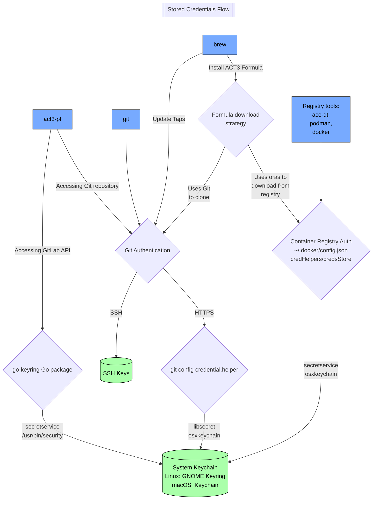

# ACT3 Login Developer Guide

## Components

ACT3 Login is divided into components:

- A script that acts as the entrypoint and handles setup
- A script that contains authentication and storage tasks
- A utility script that loads helper functions for output formatting, standard tasks, and system checks

## Execution

The script runs in the following order:

1. The user starts the first script with the one line command in the README
2. The entrypoint loads helper functions
3. The setup portion of the script runs
   - Verifies that all system prerequisites are met
   - Adds the ACT3 Homebrew tap and installs dependencies
   - Prompts the user for a GitLab URL and Personal Access Token
   - Validates token input with GitLab to confirm its existence, scope, and active status
4. The authentication portion of the script runs
   - Executes all authentication setup and storage tasks
   - Generates a new SSH key and adds it to GitLab
   - Configures HTTPS credentials for GitLab
   - Configures Git commit signing with SSH
   - Prompts the user for a GitLab container registry URL
   - Sets up authentication for ACT3 Project Tool and GitLab CLI
   - Prompts user to install DoD certificates

## Where Credentials Are Stored

The following graph illustrates how securely stored credentials are surfaced for different tools.

## Development Rules

1. Must be cross platform for Linux and macOS
   - Required platform-specific steps must be executed in conditionals, with a fallback case for "unsupported" systems
2. Do not add prerequisites
   - The only dependencies are:
     - Bash: to execute the script
     - Curl: to download the script, comes preinstalled on supported systems
     - Git: comes preinstalled on supported systems
     - Homebrew: enables cross-platform package management and use of our private Homebrew Tap
   - Any additional dependencies required during the script must be installed during the script using Homebrew
3. Check first
